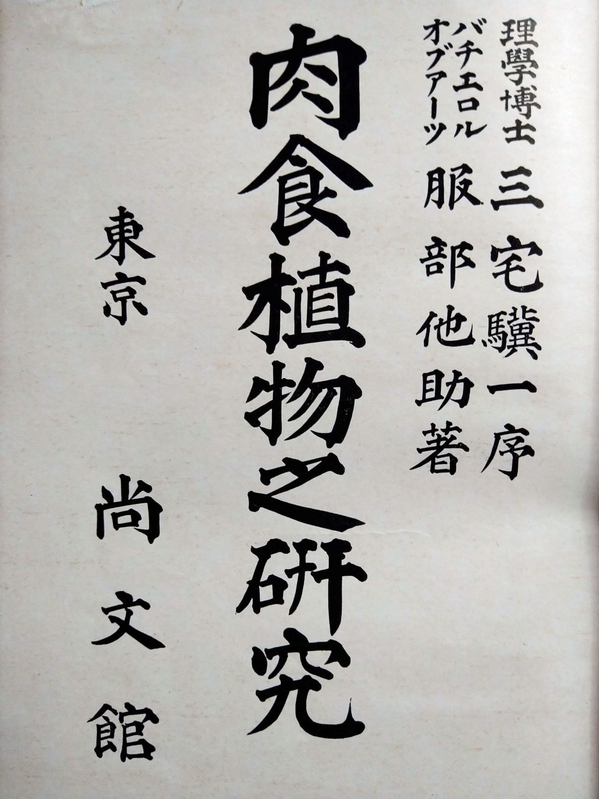

# 「服部他助(1908)肉食植物之研究」のテキスト化 Carnivorous plant research.

「服部他助(1908)肉食植物之研究」は著作権の保護期間が満了し、インターネットで公開されている。しかし、テキスト化に不備があるので、これを修正していく。

### 検討事項
- 手入力。
- OCRエンジン Tesseract（テッセラクト）のLSTM学習によるチューニング。

### リンク
- [国立国会図書館デジタルコレクション](https://dl.ndl.go.jp/)
- [Google ブックス](https://books.google.co.jp/)

